# Fractal

Este repositorio reune estudos de arte generativa e fractais em R.
As imagens de exemplo dos scripts R estao em [`outputs/`](outputs/).
As imagens dos scripts otimizados em Python estao em [`optimization/outputs/`](optimization/outputs/).

## Classificacao dos scripts

Os scripts foram organizados por tipo de arte gerada:

1. Agregacao fractal por caminhada aleatoria.
2. Campos centripetos e crescimento por atracao ao centro.
3. Trilhas e pintura por percurso.
4. Geometria e estrutura visual.
5. Paisagem urbana procedural.
6. Transformacao de imagem em pontos.
7. Caos e dinamica populacional.

## 1) Agregacao fractal por caminhada aleatoria

`Cobre.R`  
Tipo: deposicao fractal inspirada em eletroforese de cobre.  
O que faz: inicia particulas na borda inferior e deixa cada uma andar aleatoriamente ate grudar no agregado.  
Logica simples: caminho aleatorio + regra de aderencia por vizinhanca.  
Exemplo: [`outputs/cobre_base.png`](outputs/cobre_base.png)  
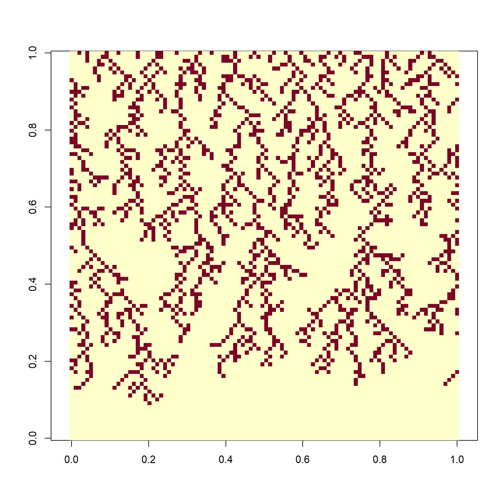

`Cobre v_2.R`  
Tipo: mesma familia de deposicao, com matriz maior e execucao mais rapida.  
O que faz: repete o processo de adesao com parametros que favorecem crescimento para cima.  
Logica simples: random walk enviesado + contato com estrutura existente.  
Exemplo: [`outputs/cobre_v2.png`](outputs/cobre_v2.png)  
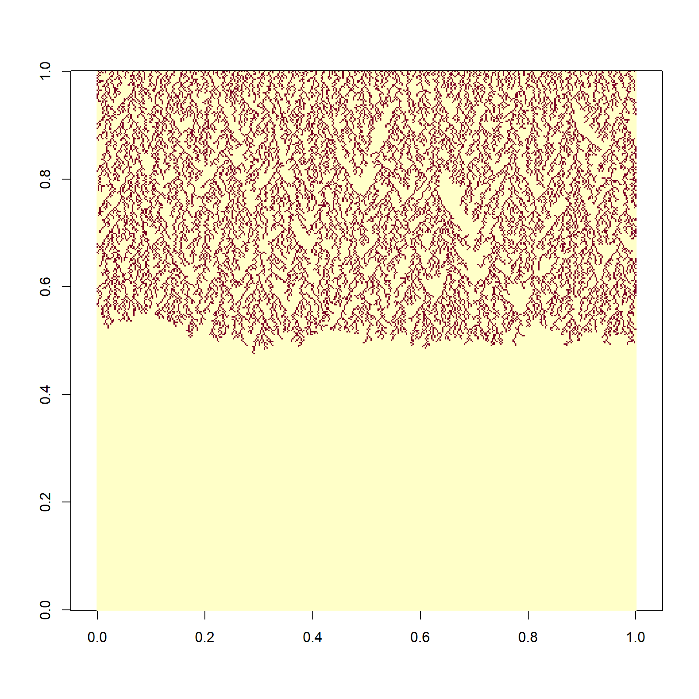

`Cobre v_3(natural lento).R`  
Tipo: agregacao radial estilo cristal/floco.  
O que faz: novas particulas nascem no contorno e caminham ate encostar no cluster central.  
Logica simples: difusao aleatoria a partir da borda + fixacao por contato.  
Exemplo: [`outputs/cobre_v3_natural_lento.png`](outputs/cobre_v3_natural_lento.png)  
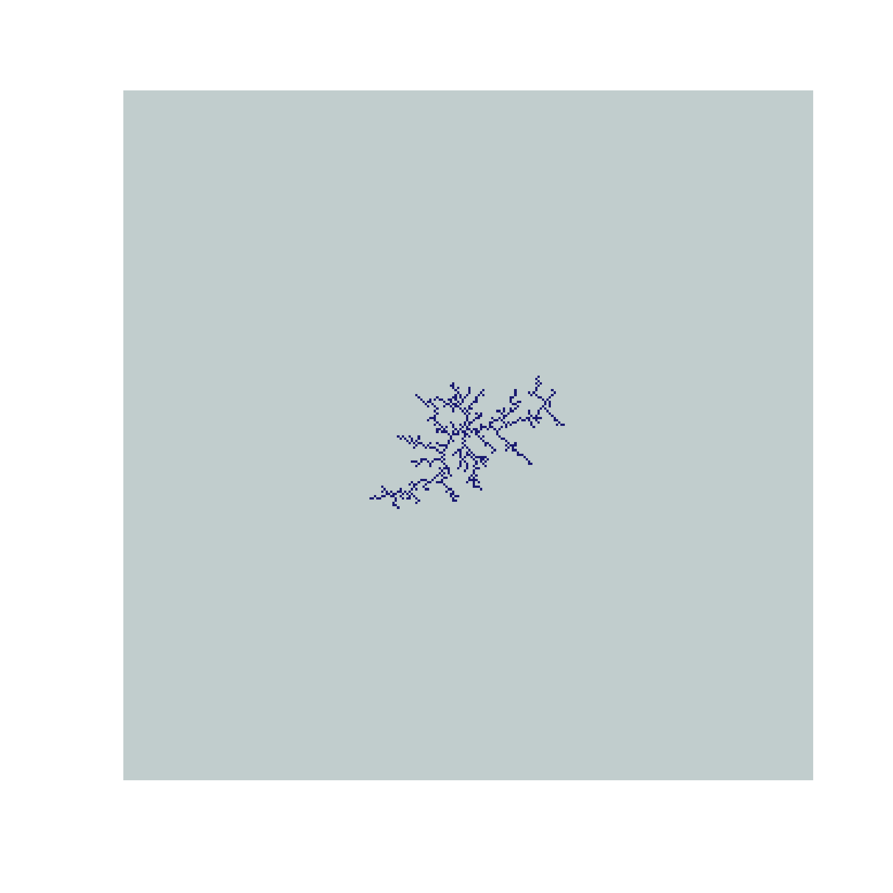

`Circular_smart_search.R`  
Tipo: floco radial com "olfato" direcional.  
O que faz: os pontos caminham da borda para dentro e alteram probabilidade de movimento quando detectam massa proxima.  
Logica simples: random walk com ajuste de probabilidade local para aproximar do agregado.  
Exemplo: [`outputs/circular_smart_search.png`](outputs/circular_smart_search.png)  
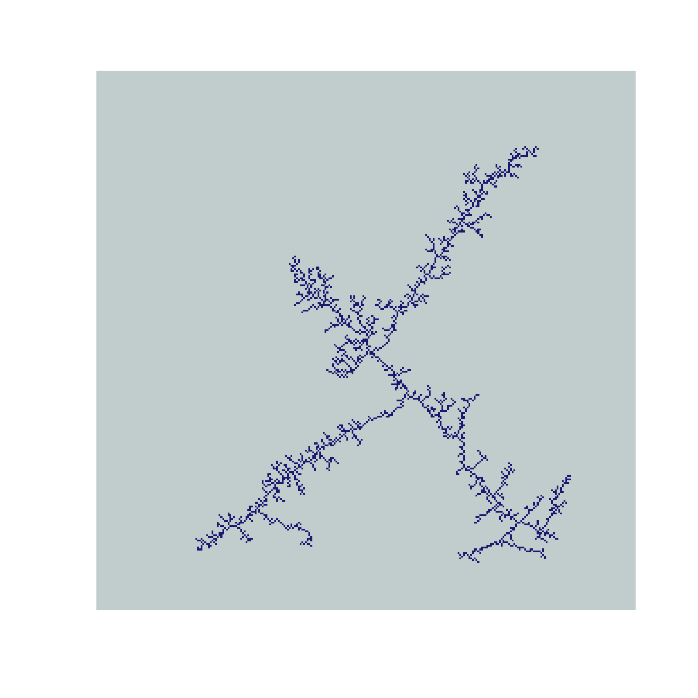

`Slow_AleatorioQuadrado.R`  
Tipo: agregacao em grade quadrada com vies de centralidade.  
O que faz: brotos saem da borda e andam dentro da matriz, priorizando celulas mais centrais.  
Logica simples: random walk com criterio de centralidade + adesao por vizinhanca.  
Exemplo: [`outputs/slow_aleatorio_quadrado.png`](outputs/slow_aleatorio_quadrado.png)  
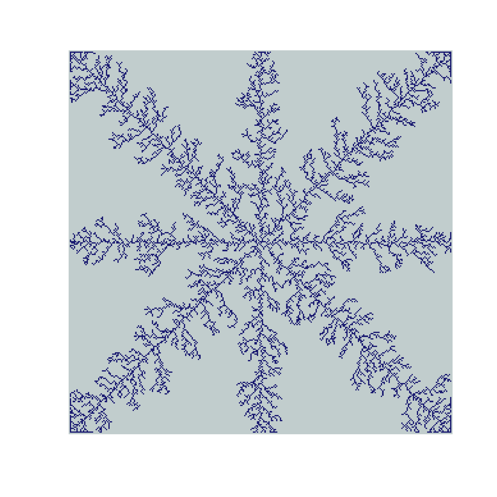

## 2) Campos centripetos e crescimento por atracao ao centro

`Fast_CentripetoCentroFixo.R`  
Tipo: crescimento por campo gravitacional para centro fixo.  
O que faz: pontos sao lancados na borda de um circulo e andam em direcao ao centro, fixando ao tocar a estrutura.  
Logica simples: passo vetorial em direcao ao centro + regra de contato.  
Exemplo: [`outputs/fast_centripeto_centro_fixo.png`](outputs/fast_centripeto_centro_fixo.png)  
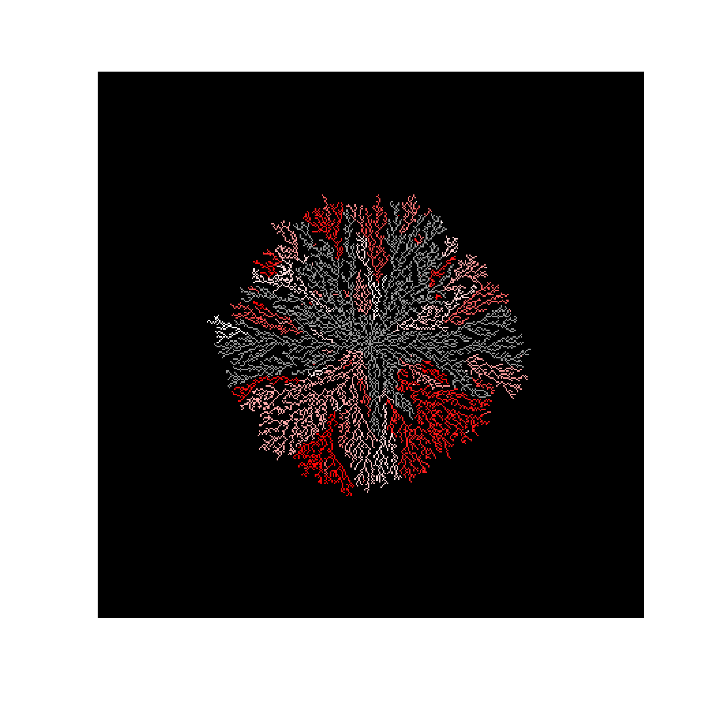

`Fast_CentripetoQuadrado.R`  
Tipo: versao quadrada do crescimento centripeto.  
O que faz: pontos nascem na borda do quadrado e caminham para o centro ate colarem no agregado.  
Logica simples: movimento direcionado por vetor para o centro + acoplamento por vizinhanca.  
Exemplo: [`outputs/fast_centripeto_quadrado.png`](outputs/fast_centripeto_quadrado.png)  
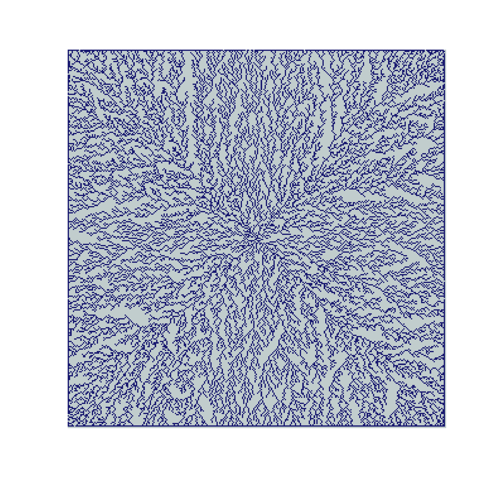

`Slow_CentripetoCirculo_CentroDeMassa.R`  
Tipo: crescimento centripeto com centro dinamico.  
O que faz: em vez de centro fixo, cada novo ponto e atraido para o centro de massa dos pontos ja fixados.  
Logica simples: centro se move com a estrutura, gerando formas organicas.  
Exemplo: [`outputs/slow_centripeto_circulo_centro_massa.png`](outputs/slow_centripeto_circulo_centro_massa.png)  


`Jumping_circular.R`  
Tipo: nuvem/cosmos por crescimento radial com escala de intensidade.  
O que faz: pontos saem da borda e caminham em direcao ao centro de massa mutavel; alguns recebem valores altos para destacar regioes.  
Logica simples: atracao + "saltos" de intensidade + paleta de cor para destacar densidade.  
Exemplo: [`outputs/jumping_circular_cosmos.png`](outputs/jumping_circular_cosmos.png)  
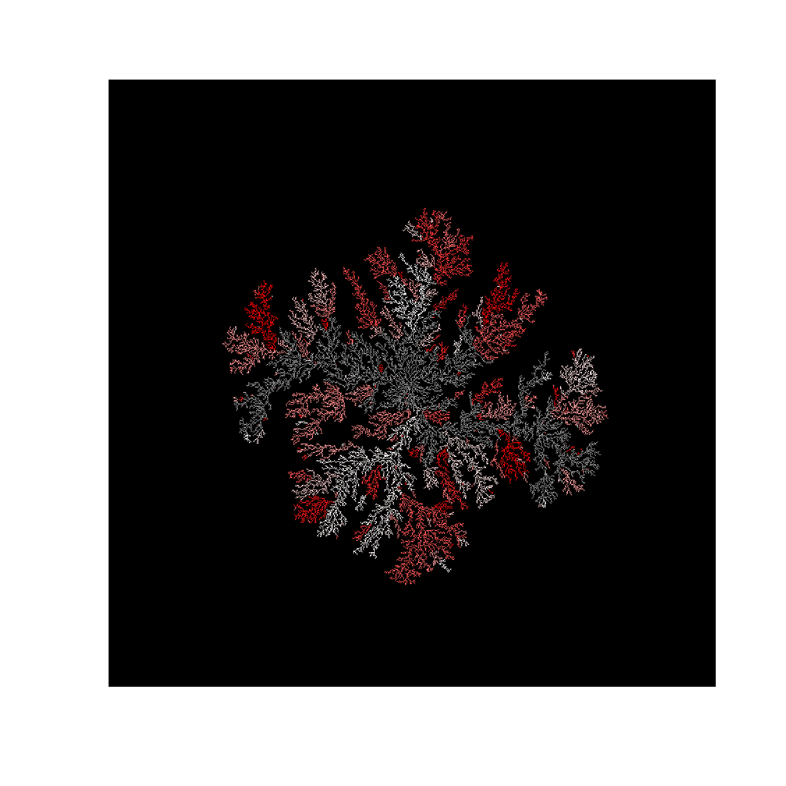

## 3) Trilhas e pintura por percurso

`Lone_pixel_Art.R`  
Tipo: pintura de trilha unica.  
O que faz: um unico caminhante percorre o espaco ate encostar no nucleo central, colorindo o caminho pelo numero de passos.  
Logica simples: random walk + acumulacao de "tempo de percurso" para virar gradiente visual.  
Exemplo: [`outputs/lone_pixel_art.png`](outputs/lone_pixel_art.png)  
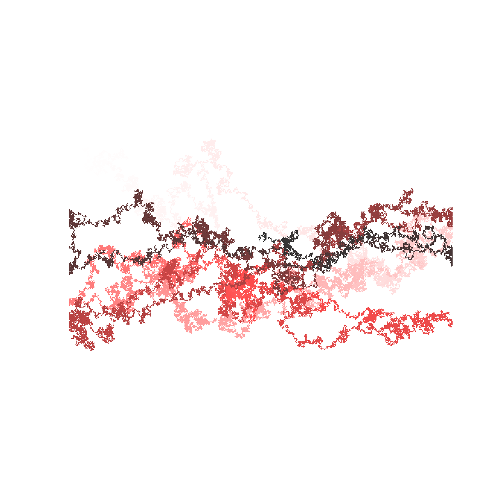

`Painting_runs.R`  
Tipo: composicao de multiplas trilhas com pos-processamento.  
O que faz: varios caminhantes deixam rastros em uma matriz ampliada e a imagem final pode ser suavizada com filtro gaussiano.  
Logica simples: soma de trilhas + color map + opcao de blur para efeito pictorico.  
Exemplo: [`outputs/painting_runs.jpg`](outputs/painting_runs.jpg)  
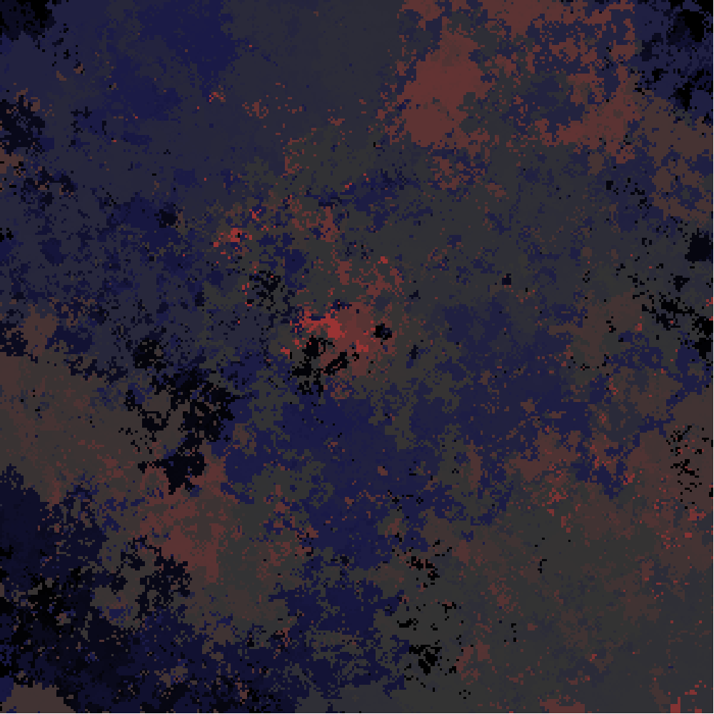

## 4) Geometria e estrutura visual

`Circle_matrix.R`  
Tipo: geometria discreta em matriz.  
O que faz: sorteia angulos e marca pontos na circunferencia em uma grade.  
Logica simples: trigonometria (seno/cosseno) para converter angulo em coordenada da matriz.  
Exemplo: [`outputs/circle_matrix.png`](outputs/circle_matrix.png)  
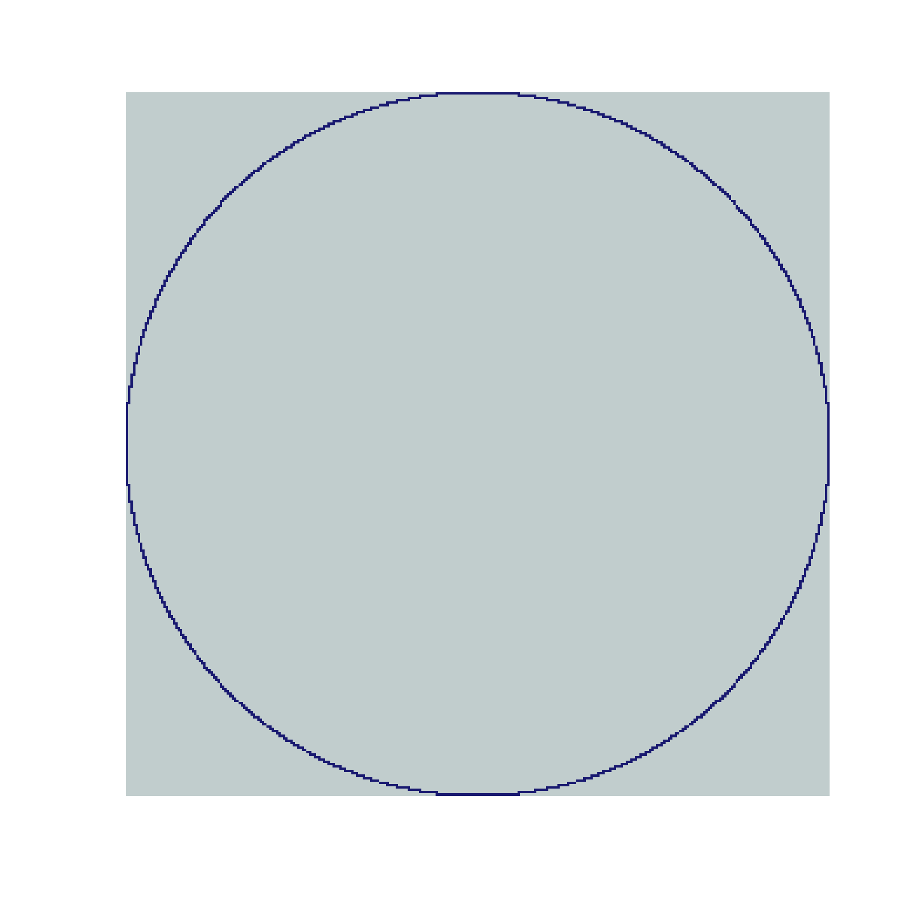

`Circle.R`  
Tipo: geometria analitica da circunferencia.  
O que faz: desenha os arcos superior e inferior da equacao do circulo.  
Logica simples: aplica `y = j +/- sqrt(r^2 - (x-i)^2)` em muitos valores de `x`.  
Exemplo: [`outputs/circle_curve.png`](outputs/circle_curve.png)  
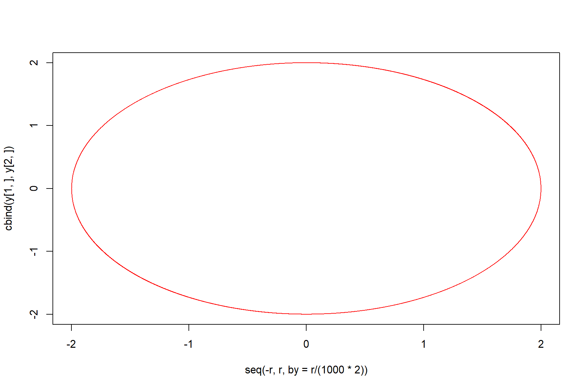

`3d_crosseyed_scaffold.R`  
Tipo: grade estrutural para composicao estereoscopica.  
O que faz: desenha pontos periodicos em grade, formando um andaime visual que pode servir como base para efeitos 3D cross-eyed.  
Logica simples: amostragem regular de coordenadas em uma malha quadrada.  
Exemplo: [`outputs/3d_crosseyed_scaffold.png`](outputs/3d_crosseyed_scaffold.png)  
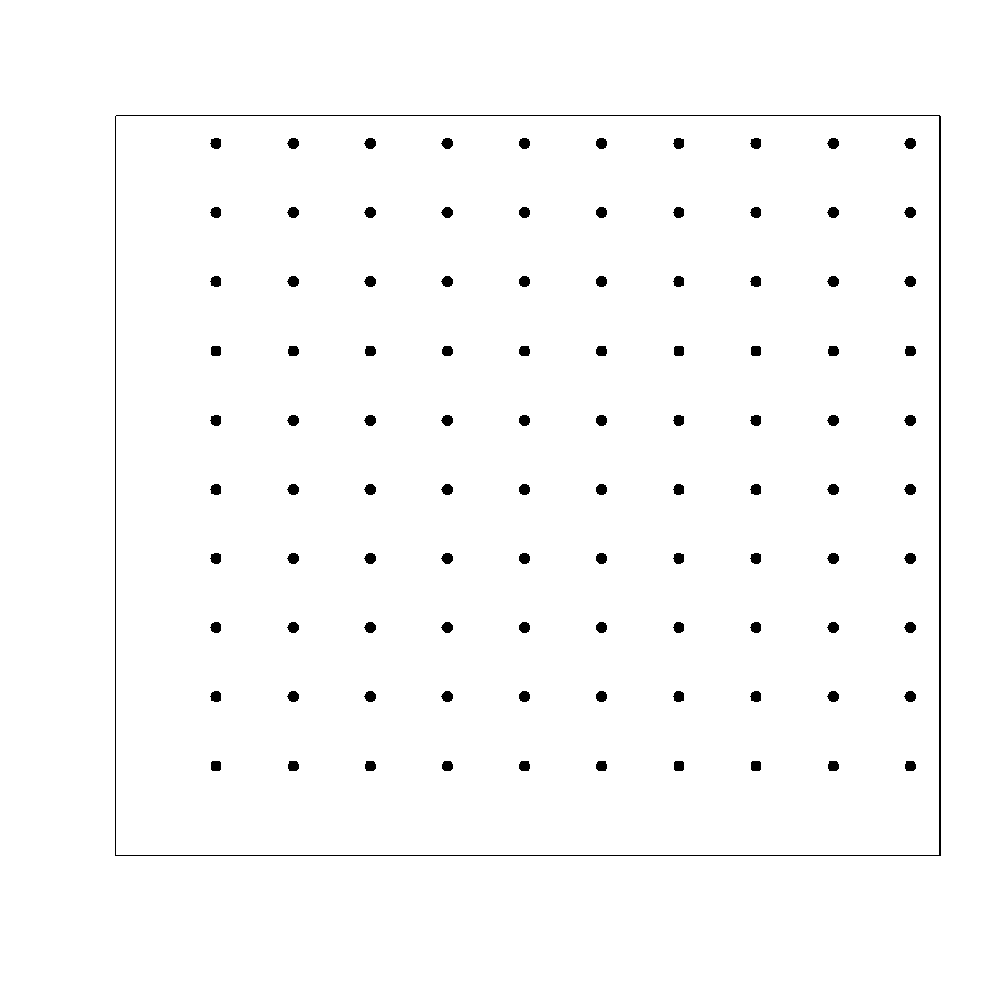

## 5) Paisagem urbana procedural

`BuildingSkylineNight.R`  
Tipo: skyline noturno em camadas.  
O que faz: gera contornos de predios com ruido gaussiano, adiciona estrelas e lua, e empilha camadas para profundidade.  
Logica simples: ruido aleatorio controlado + preenchimento por poligonos.  
Exemplo: [`outputs/building_skyline_night.png`](outputs/building_skyline_night.png)  
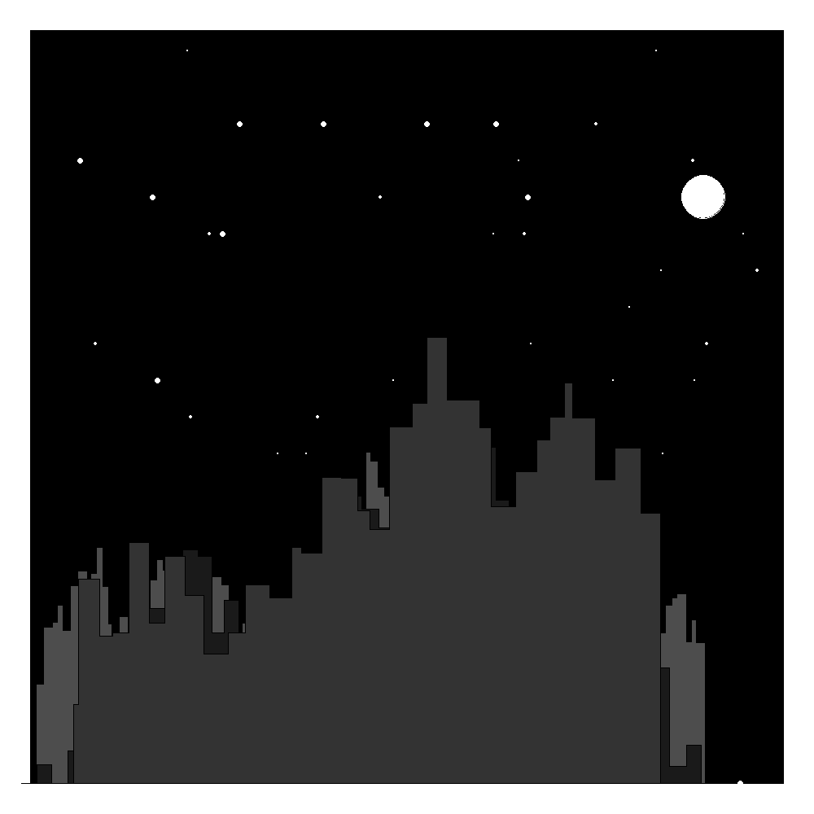

`BuildingSkylineNight2.R`  
Tipo: skyline com janelas e mais detalhamento.  
O que faz: expande a ideia anterior adicionando pontos de luz (janelas) em diferentes intensidades.  
Logica simples: mesma base em camadas + distribuicao aleatoria de janelas.  
Exemplo: [`outputs/building_skyline_night2.png`](outputs/building_skyline_night2.png)  
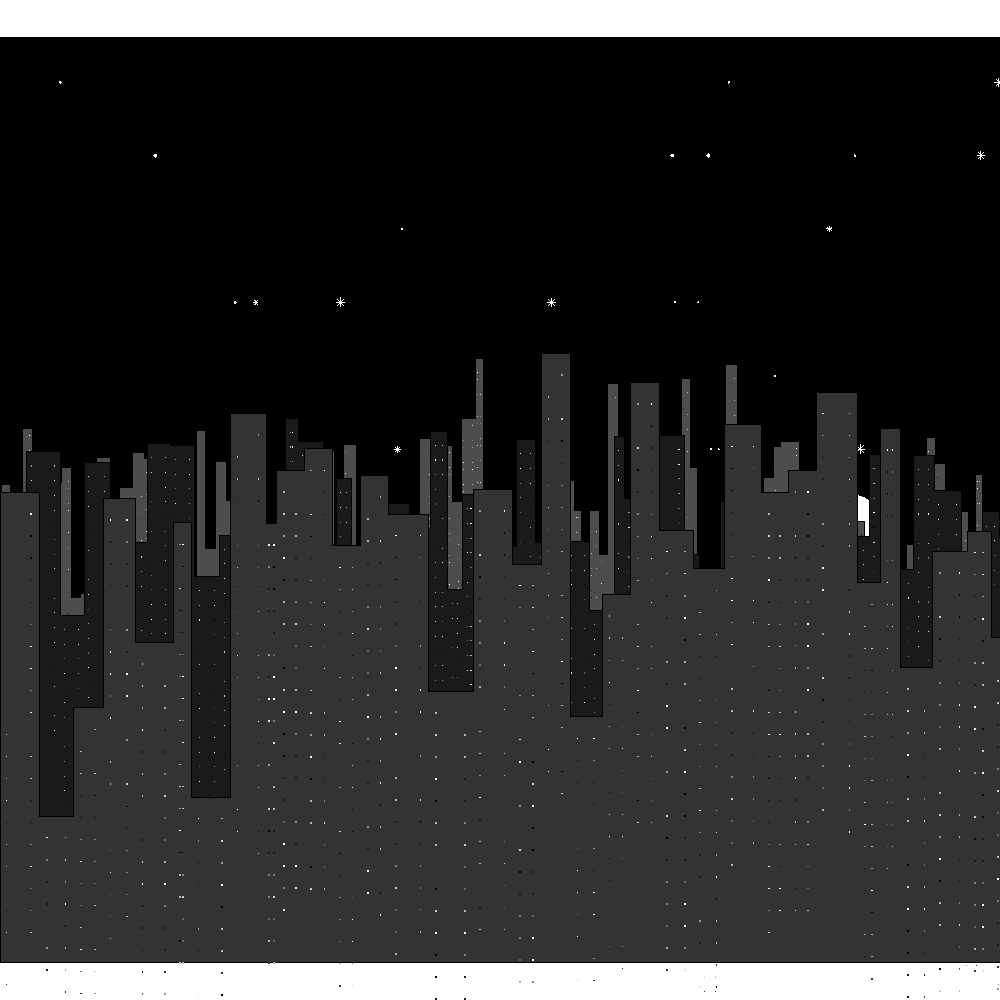

`BuildingSkylineNight3.R`  
Tipo: skyline com escala parametrica de quadro.  
O que faz: adapta tamanhos e densidades ao tamanho da imagem para manter proporcao visual.  
Logica simples: parametrizacao de escala + pipeline de camadas urbanas.  
Exemplo: [`outputs/building_skyline_night3.png`](outputs/building_skyline_night3.png)  
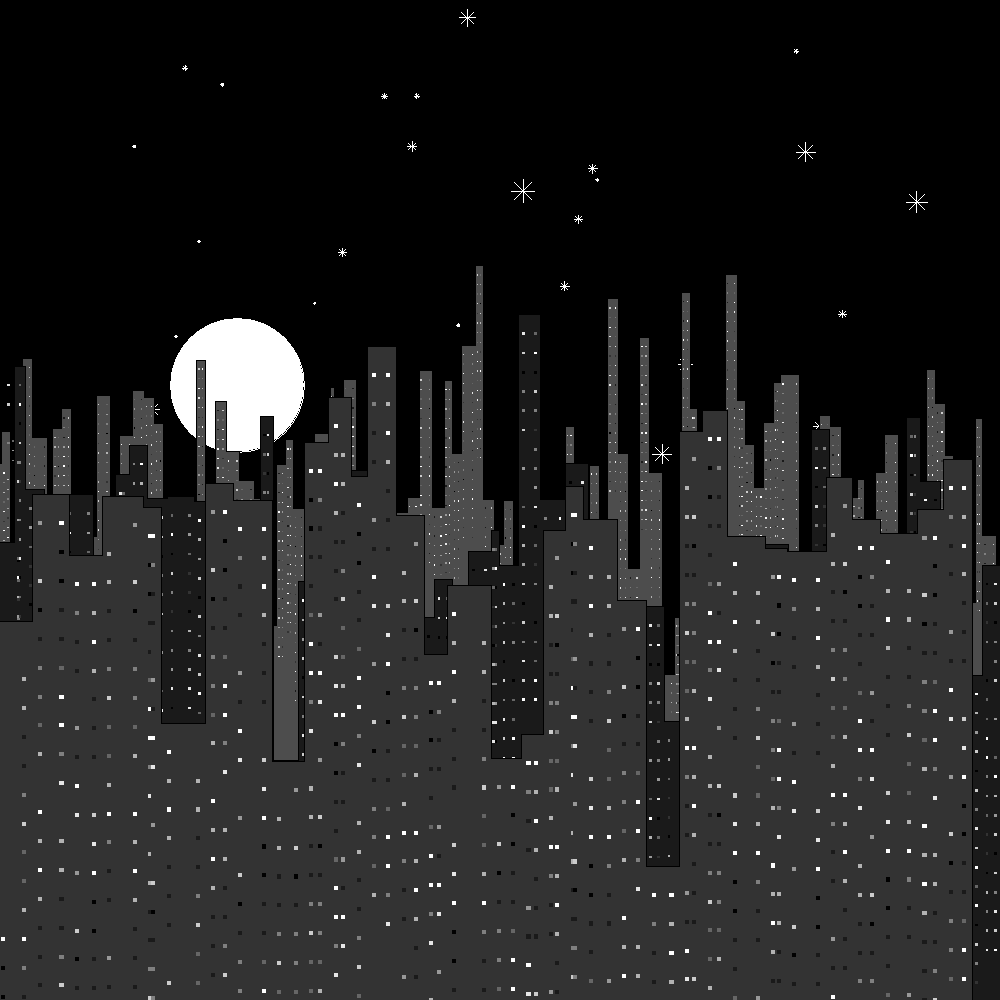

`BuildingSkylineNight3_Alpha.R`  
Tipo: skyline com enfase em transparencia/alpha.  
O que faz: usa distribuicao de alpha nas janelas para criar luzes mais atmosfericas.  
Logica simples: mesma composicao da versao 3, trocando a distribuicao de cores por pesos de transparencia.  
Exemplo: [`outputs/building_skyline_night3_alpha.png`](outputs/building_skyline_night3_alpha.png)  
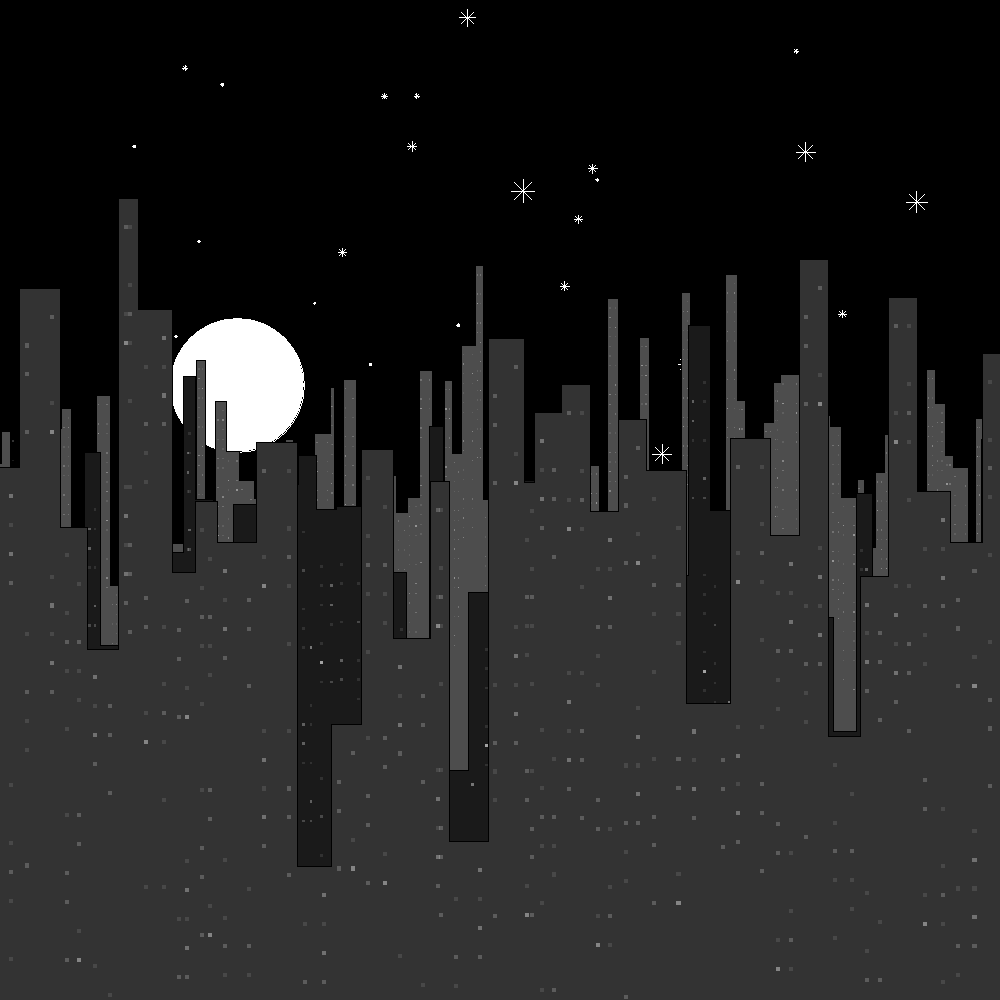

## 6) Transformacao de imagem em pontos

`PNG_to_scatterplot.R`  
Tipo: pixel-to-points / pontilhismo orientado por imagem.  
O que faz: le uma imagem PNG e desenha um ponto por pixel, com tamanho proporcional a intensidade do pixel.  
Logica simples: converter matriz de pixels em nuvem de pontos com tamanho variavel.  
Exemplo: [`outputs/png_to_scatterplot.png`](outputs/png_to_scatterplot.png)  
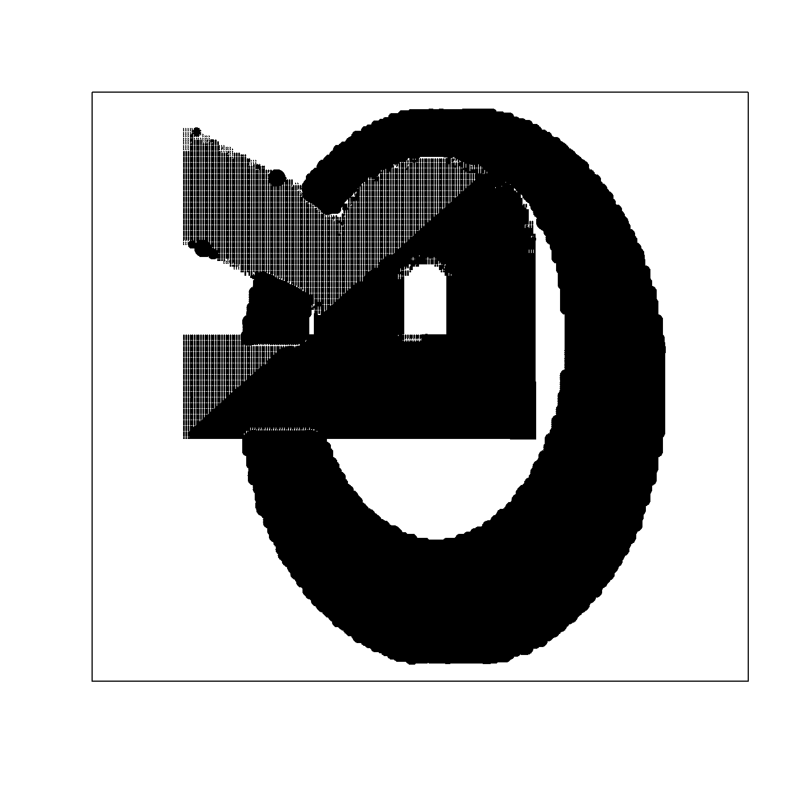

Observacao: o script original usa uma URL externa que hoje esta indisponivel. O exemplo foi gerado com a mesma logica usando uma PNG publica alternativa.

## 7) Caos e dinamica populacional

`Rabbit_Population.R`  
Tipo: diagrama de bifurcacao (mapa logistico).  
O que faz: plota os estados de equilibrio da populacao para varias taxas de replicacao.  
Logica simples: iteracao da equacao `x_{n+1} = r*x_n*(1-x_n)` e plot dos estados finais.  
Exemplo: [`outputs/rabbit_population_bifurcacao.png`](outputs/rabbit_population_bifurcacao.png)  
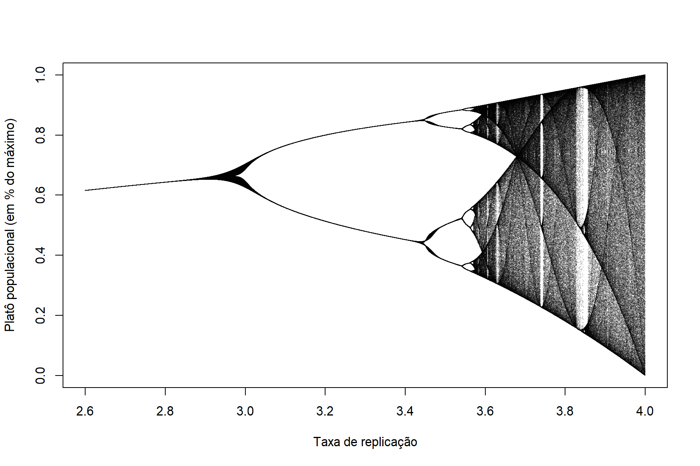

## Otimizacao em Python

Os scripts abaixo ficam em [`optimization/`](optimization/) e geram imagens por padrao em [`optimization/outputs/`](optimization/outputs/).

### `optimization/Cobre.py`

Inspirado em: `Cobre.R` e `Cobre v_2.R`.  
Logica otimizada: DLA com fronteira de crescimento (launch/kill windows), wrap horizontal e matriz com padding para checagem de vizinhanca sem custo extra de borda.  
Comando:

```bash
python optimization/Cobre.py
```

Saida padrao: [`optimization/outputs/cobre_optimized.png`](optimization/outputs/cobre_optimized.png)

### `optimization/Floco.py`

Inspirado em: `Cobre v_3(natural lento).R`, `Circular_smart_search.R`, `Slow_AleatorioQuadrado.R`, `Fast_CentripetoCentroFixo.R`, `Fast_CentripetoQuadrado.R`, `Slow_CentripetoCirculo_CentroDeMassa.R`, `Jumping_circular.R`.  
Logica otimizada: motor unificado com opcoes de geometria (`circle|square`), alvo (`fixed|center-mass`) e modo (`flake|cosmos`), com difusao + atracao centripeta em coordenadas continuas.  
Comando:

```bash
python optimization/Floco.py
```

Saida padrao: [`optimization/outputs/floco_optimized.png`](optimization/outputs/floco_optimized.png)

### `optimization/Trilhas.py` (v1 preservada)

Inspirado em: `Lone_pixel_Art.R` e `Painting_runs.R`.  
Logica otimizada: caminhantes vindos da borda com atracao ao centro e acumulacao de trilha + blur.  
Nota visual: essa versao pode formar uma estrutura axial (cruz) porque parte do deslocamento usa direcoes alinhadas aos eixos via `sign(center - pos)`.  
Comando:

```bash
python optimization/Trilhas.py
```

Saida padrao: [`optimization/outputs/trilhas_optimized.png`](optimization/outputs/trilhas_optimized.png)

### `optimization/Trilhas_v2.py` (nova versao "nuvem")

Inspirado em: mesma familia (`Lone_pixel_Art.R` + `Painting_runs.R`), com foco em nuvem isotropica.  
Logica otimizada: caminhada aleatoria continua com ruido gaussiano isotropico, inercia, atracao radial suave e acumulacao bilinear de densidade. Isso remove o artefato de cruz e gera massa difusa de nuvem.  
Comando:

```bash
python optimization/Trilhas_v2.py
```

Saida padrao: [`optimization/outputs/trilhas_optimized_v2.png`](optimization/outputs/trilhas_optimized_v2.png)

### `optimization/Buildings.py`

Inspirado em: `BuildingSkylineNight3.R`.  
Logica otimizada: composicao procedural por camadas (ceu gradiente, estrelas, lua, predios por distribuicoes controladas e janelas com alpha).  
Comando:

```bash
python optimization/Buildings.py
```

Saida padrao: [`optimization/outputs/buildings_optimized.png`](optimization/outputs/buildings_optimized.png)

### `optimization/mapaLogi.py`

Inspirado em: `Rabbit_Population.R`.  
Logica otimizada: bifurcacao do mapa logistico totalmente vetorizada com NumPy (iteracoes em bloco para milhares de valores de `r`).  
Comando:

```bash
python optimization/mapaLogi.py
```

Saida padrao: [`optimization/outputs/mapa_logistico_optimized.png`](optimization/outputs/mapa_logistico_optimized.png)

